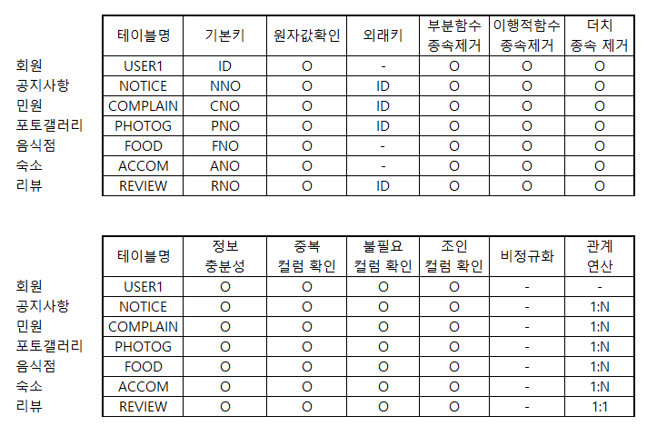
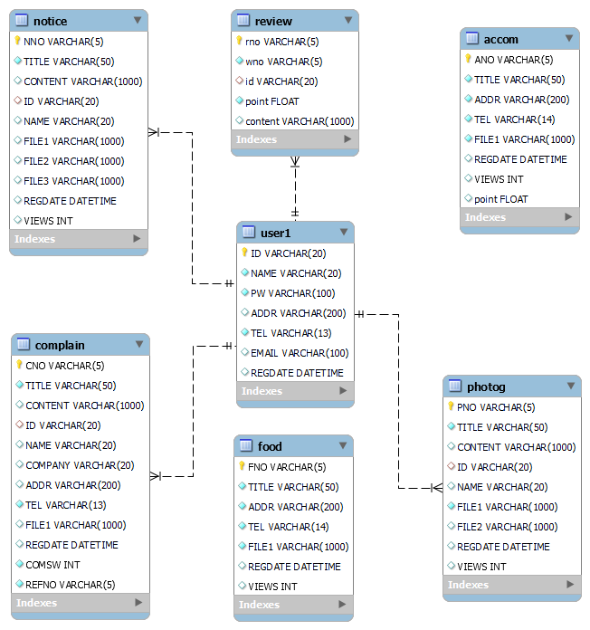
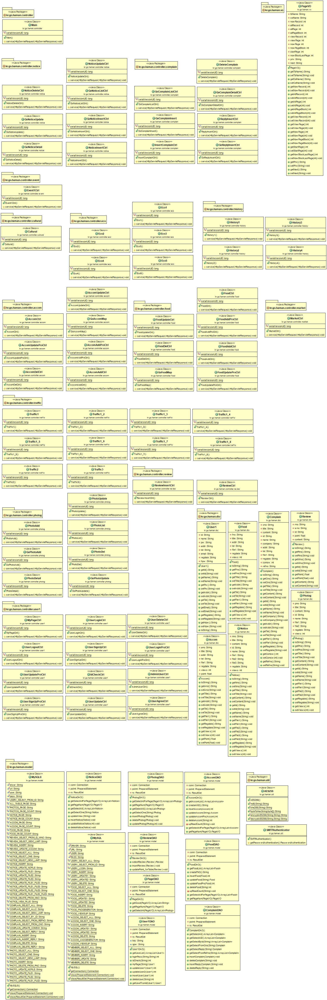
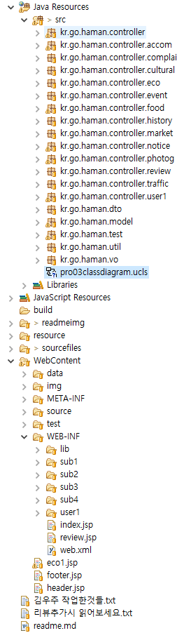

# 프로젝트 개요
## 프로젝트 명 : 함안 관광청
## 프로젝트 기간 : 2023.05.17 ~
## 프로젝트 참여  : 김우주 , 조태정
## JAVA ver : 1.8.0_241
## IDE(통합개발도구) : Eclipse Luna
## JAVA script ver : 1.0
## Dynamic Web Module : 3.1
## DBMS : MySQL 8.0.28 + MySQL Workbench 8.0 CE + ANSI SQL Query
## External Library : json , cos , commons , crypto 
## JAVA Script Plugin : JQuery
## Css FrameWork : bulma.io v0.9.4
## JAVA Script API : DAUM 주소 API , json 데이터 처리 , 카카오지도 api
## 프로젝트 데이터 처리패턴 : MVC2
- View -> Controller > Model > Controller > View

 

## 프로젝트 주요 기능 : 회원 , 공지사항 , 리뷰 , 다음api활용 , 고객민원(QNA) , 페이징처리 등

 

## 프로젝트 특이사항
### 회원 가입
- 회원 가입시 회원 약관에 동의해야 회원가입 페이지로 넘어가도록 구현
- 아이디 중복체크 시 json을 이용해 현재 창에서 구현
- 비밀번호는 AES256을 이용하여 암호화 처리하여 저장
- 주소의 입력은 DAUM 주소 API를 활용하여 입력받아 저장

### 공지사항(게시판)
- 관리자계정(admin)만 모든 글을 수정 및 삭제 가 가능함
- 첨부파일 기능을 구현하여 업로드가 가능
- 해당하는 글에 들어가 업로드 되어있는 파일 다운로드 가능
- 썸네일과 본문에 올라갈 사진페이지를 구현
- 페이지 기능을 구현함 

### 별점주기(리뷰)
- json을 이용해 해당 숙소에 별점을 남기도록 구현
- 악의적으로 별점을 낮출수 있기에 로그인 한 사용자 한명당 한 개의 숙소에만 별점을 줄 수 있음

### 고객민원QnA
- 민원인 정보 보호를 위해 자신의 민원만 볼 수 있도록 구현
- 민원인 정보 보호를 위하여 민원은 10개까지만 수집
- 답변은 관리자만 달수 있도록 구현
- 답변이 달린 민원은 답변 완료로 표시하도록 구현

### 관리자
- 관리자는 회원정보를 수정 , 조회 및 탈퇴 가 가능하여야한다
- 관리자는 공지사항의 등록, 수정 및 삭제가 가능하여야 한다
- 관리자는 숙소 게시판의 등록 수정 및 삭제가 가능하여야한다
- 관리자는 음식점 게시판의 등록 수정 및 삭제가 가능하여야 한다
- 관리자는 질문및 답변에서 질문 수정은 못하지만 삭제 할 수있어야 하며 그에대한 답변을 달 수 있어야한다

---

# 프로젝트 설계
## 개념적 설계 (유스케이스)
- 유스케이스

---
## 논리적 설계 (검증 표)
- 논리 검증 체크리스트

- 논리적 ERD

---
## 물리적 설계
- 데이터베이스 ERD

---
## 클래스 설계
- 클래스 다이어 그램

---
## 시퀀스 설계
- 시퀀스 설명

---
## 프로젝트 구성
- (리소스구성도)

